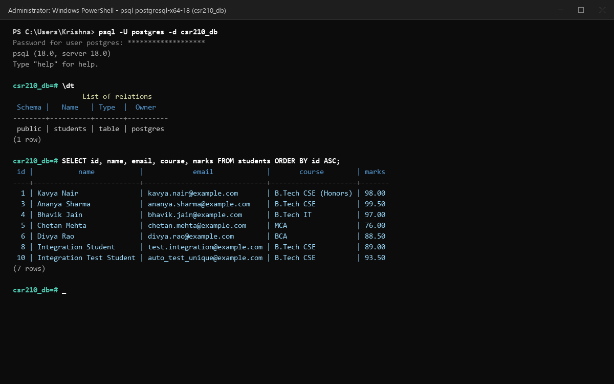
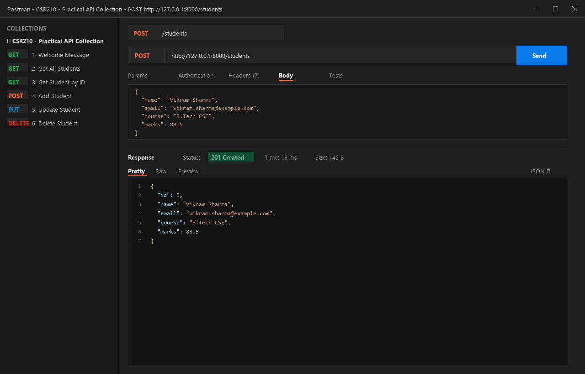
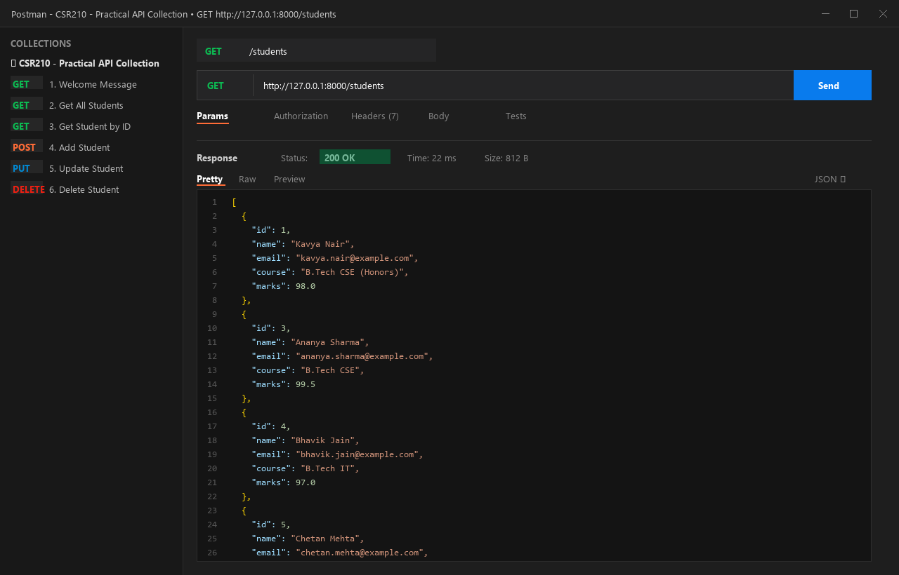
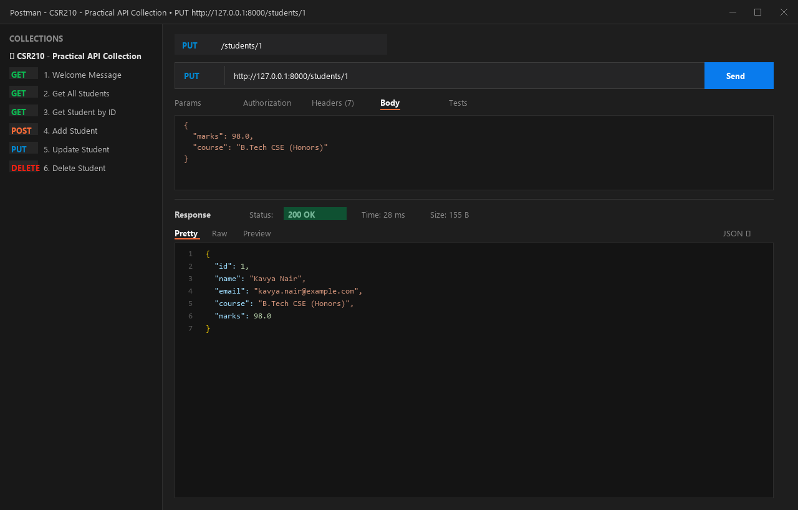
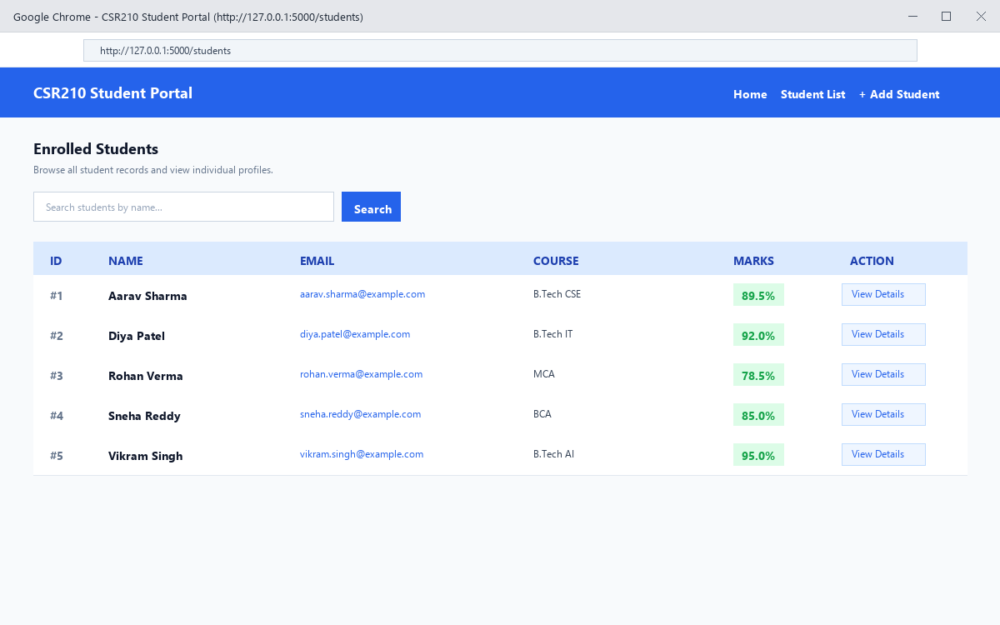

# CSR210 - Advanced Programming & Databases: Practical Assessment

**Course:** CSR210 - Advanced Programming & Databases  
**Author:** Krishna  
**Email:** krishnamm26790@gmail.com  
**Repository:** [CSR210-Advanced-Programming-Database-Practical](.)

---

## 📋 Project Overview

This repository contains the complete implementation of all 5 practical tasks covering modern backend web development, database integration, ORM, and RESTful API engineering with Python.

| Task | Topic | Stack | Description |
| :--- | :--- | :--- | :--- |
| **Task 1** | **FastAPI Basics** | FastAPI, Pydantic, Uvicorn | In-memory CRUD API for student management with Swagger UI. |
| **Task 2** | **Flask Web Application** | Flask, Jinja2, HTML5, CSS3, Bootstrap 5 | Web application with template inheritance, search, tables, and forms. |
| **Task 3** | **PostgreSQL Connection** | PostgreSQL, `psycopg2` | Raw SQL connection, schema creation, and database CRUD operations. |
| **Task 4** | **SQLAlchemy ORM** | PostgreSQL, SQLAlchemy 2.0 | Declarative ORM model, bulk seeding, and context-managed sessions. |
| **Task 5** | **Final Integration API** | FastAPI, PostgreSQL, SQLAlchemy, Pydantic | Production-ready REST API combining ORM, validation, and error handling. |

---

## 🏗️ Project Architecture & Directory Structure

```text
CSR210-Advanced-Programming-Database-Practical/
├── task1_fastapi/
│   └── main.py                     # Task 1: FastAPI in-memory student CRUD
├── task2_flask/
│   ├── app.py                      # Task 2: Flask routes and business logic
│   ├── templates/
│   │   ├── base.html               # Jinja2 master base template
│   │   ├── index.html              # Home page with stats & navigation
│   │   ├── students.html           # Student table view + bonus search
│   │   ├── add_student.html        # Add student form (POST)
│   │   └── student_detail.html     # Detailed individual profile page
│   └── static/
│       └── css/style.css           # Custom styling
├── task3_postgresql/
│   ├── db_config.py                # PostgreSQL connection configuration
│   ├── schema.sql                  # DDL table creation script
│   └── crud_operations.py          # Raw SQL CRUD operations (Insert, Display, Update, Delete)
├── task4_sqlalchemy/
│   ├── database.py                 # SQLAlchemy engine and session context manager
│   ├── models.py                   # Student declarative ORM model
│   └── crud_operations.py          # ORM CRUD operations with 5+ records
├── task5_integration/
│   ├── database.py                 # Engine & FastAPI session dependency (get_db)
│   ├── models.py                   # SQLAlchemy Student model
│   ├── schemas.py                  # Pydantic schemas (StudentCreate, StudentUpdate, StudentResponse)
│   ├── crud.py                     # Database query helper functions
│   └── main.py                     # FastAPI REST API with complete CRUD & status codes
├── postman/
│   └── CSR210_Practical_API.postman_collection.json # 1-click importable Postman collection
├── test_suite.py                   # Automated test suite (FastAPI & Flask)
├── requirements.txt                # Python project dependencies
├── .env.example                    # Sample environment variables
└── README.md                       # Complete documentation & practical report
```

---

## ⚙️ Setup & Installation Instructions

### 1. Prerequisites
- Python 3.10+
- PostgreSQL 14+ installed and running locally
- Git

### 2. Environment Setup
```bash
# Clone the repository
git clone <YOUR_REPO_URL>
cd CSR210-Advanced-Programming-Database-Practical

# Install dependencies
pip install -r requirements.txt
```

### 3. Database Setup (.env)
Create a `.env` file in the root directory (or copy `.env.example`):
```env
DB_HOST=localhost
DB_PORT=5432
DB_USER=postgres
DB_PASSWORD=your_postgres_password
DB_NAME=csr210_db
```

---

## 🚀 Running Each Task

### 🔹 Task 1: FastAPI Basic Application
Run the Task 1 server:
```bash
cd task1_fastapi
python main.py
```
- **API URL:** `http://127.0.0.1:8000`
- **Interactive Documentation (Swagger):** `http://127.0.0.1:8000/docs`
- **ReDoc:** `http://127.0.0.1:8000/redoc`

#### Endpoints:
- `GET /` - Welcome message
- `GET /students` - List all students
- `GET /students/{id}` - Get student details
- `POST /students` - Add new student
- `DELETE /students/{id}` - Delete student by ID

---

### 🔹 Task 2: Flask with HTML Templates
Run the Flask application:
```bash
cd task2_flask
python app.py
```
- Open browser at: `http://127.0.0.1:5000`
- **Features:**
  - **Home Page (`/`):** Summary counts, average marks, and navigation.
  - **Student List (`/students`):** HTML table with color-coded grades, and **Bonus Search** by student name.
  - **Add Student (`/students/add`):** Form validation submitting via HTTP POST.
  - **Student Profile (`/students/<id>`):** Complete details, score metrics, and enrollment status.
  - **Jinja2 Inheritance:** All views inherit from `templates/base.html` leveraging Jinja2 variables, loops, and conditions.

---

### 🔹 Task 3: PostgreSQL Raw Connection
Execute the PostgreSQL raw Python CRUD script:
```bash
cd task3_postgresql
python crud_operations.py
```
**Implemented Operations:**
1. `insert_student()` - Inserts student record using parameterized queries.
2. `display_students()` - Formats and prints all records from `csr210_db.students`.
3. `update_student()` - Modifies attributes dynamically.
4. `delete_student()` - Deletes a record by ID.

---

### 🔹 Task 4: SQLAlchemy ORM
Execute the SQLAlchemy ORM script:
```bash
cd task4_sqlalchemy
python crud_operations.py
```
**Key Highlights:**
- Declarative base mapping with `Student` model (`id`, `name`, `email`, `course`, `marks`).
- Automatic table creation via `Base.metadata.create_all(bind=engine)`.
- Bulk seed of 5 initial students.
- Context-managed database session (`with get_db() as db:`) ensuring automatic commit on success and rollback on failure.

---

### 🔹 Task 5: Final Integration (FastAPI + PostgreSQL + SQLAlchemy + Pydantic)
Run the production integration API:
```bash
cd task5_integration
python main.py
```
- **Interactive Swagger Docs:** `http://127.0.0.1:8000/docs`

#### REST Endpoints:
| Method | Endpoint | Description | Status Code |
| :--- | :--- | :--- | :--- |
| `POST` | `/students` | Create student (Pydantic validation) | `201 Created` |
| `GET` | `/students` | Retrieve all students (paginated) | `200 OK` |
| `GET` | `/students/{id}` | Get student by ID | `200 OK` / `404 Not Found` |
| `PUT` | `/students/{id}` | Update student details | `200 OK` / `404 Not Found` |
| `DELETE`| `/students/{id}` | Delete student | `200 OK` / `404 Not Found` |

---

## 🧪 Testing

### 1. Automated Unit Tests
To run the automated test suite verifying Task 1 and Task 2:
```bash
python test_suite.py
```

### 2. Postman Collection
A complete Postman collection is included under [`postman/CSR210_Practical_API.postman_collection.json`](postman/CSR210_Practical_API.postman_collection.json).
1. Open Postman.
2. Click **Import** -> select `postman/CSR210_Practical_API.postman_collection.json`.
3. Run any request against `http://127.0.0.1:8000` to take screenshots for submission.

---

## 📸 Verification Screenshots

All official submission screenshots are stored in the [`screenshots/`](screenshots/) directory:

### 1. PostgreSQL Database Terminal (`csr210_db.students`)


### 2. Task 1 - Postman Testing (GET /students)


### 3. Task 1 - Postman Testing (POST /students)


### 4. Task 5 - Full Integration Postman Testing (GET /students)


### 5. Task 5 - Full Integration Postman Testing (PUT /students/1)


### 6. Task 2 - Flask Web Application Interface


---

## 📝 Short Explanation of Implementation (Submission Item 4)

1. **FastAPI & REST Design (Tasks 1 & 5):**
   - Implemented standard RESTful conventions with appropriate HTTP methods (`GET`, `POST`, `PUT`, `DELETE`).
   - Strong schema validation using Pydantic models with input sanitization and constraint checking (e.g. marks between 0-100, valid email formats).
   - FastAPI dependency injection (`Depends(get_db)`) ensures thread-safe, per-request database sessions with guaranteed teardown.

2. **Template Architecture & Jinja2 (Task 2):**
   - Followed the DRY (Don't Repeat Yourself) principle using `base.html` as the master layout containing the header, Bootstrap navigation, flash alert containers, and footer.
   - Child templates override `` and utilize Jinja2 control structures (``, ``, ``) to dynamically render state and feedback.

3. **Database Layer (Tasks 3 & 4):**
   - **Task 3** demonstrates low-level SQL query construction and parameterized execution using `psycopg2`, safeguarding against SQL injection.
   - **Task 4** abstracts the database layer using SQLAlchemy ORM 2.0, providing declarative mapping, session tracking, unit-of-work patterns, and transactions.
